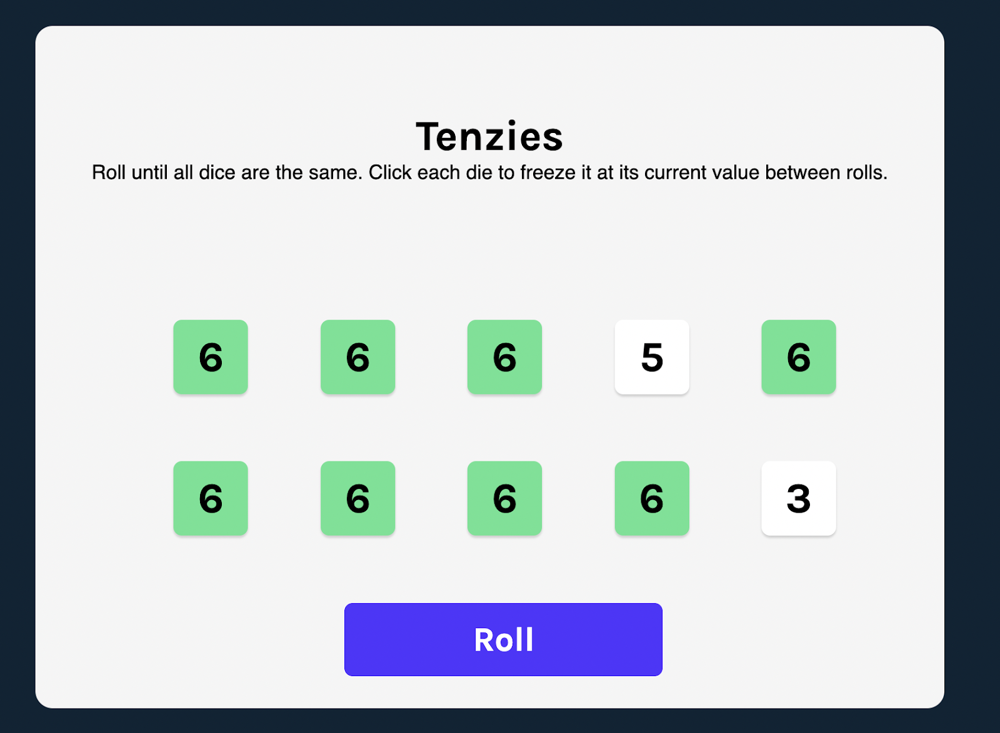
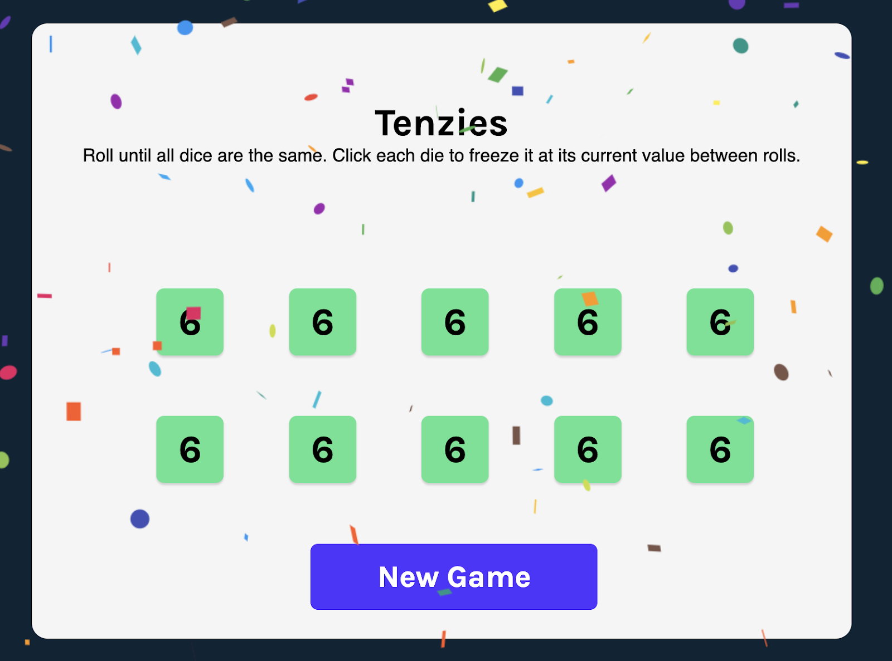
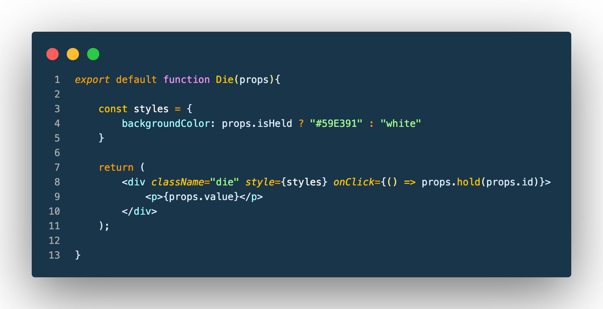
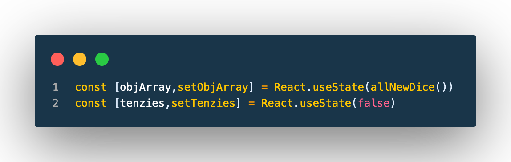
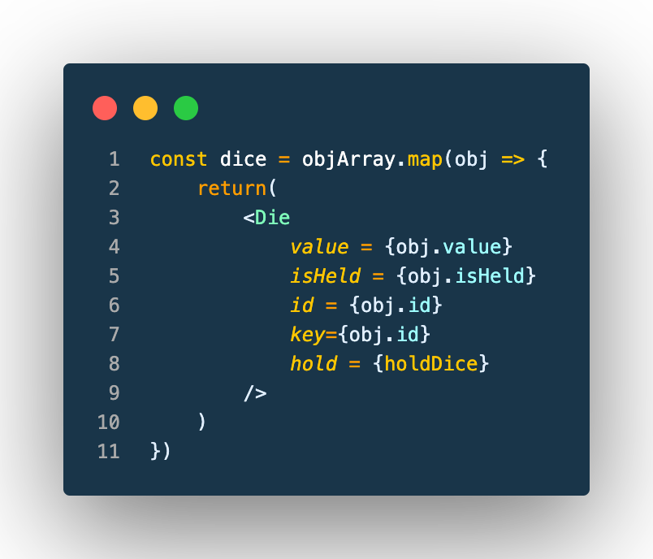
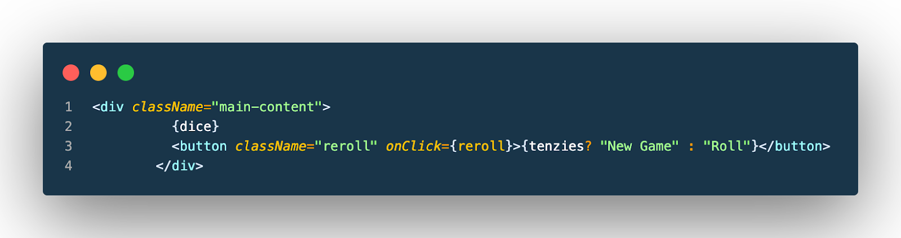

# Tenzies

## Brief
*Disclaimer - This project was completed alongside an online course for learning purposes. The tutorial can be found at https://scrimba.com/learn/learnreact

This website is a single player adaptation of the game tenzi. The aim of the game is to roll dice until all the digits are the same. I completed this project to reinforce the topics that were learned along the length of the online course linked above. Some of the topics that were used to complete this project were  useEffect, useState, conditional rendering, Event listeners and more.

Project Dificulty : Complex

## Project Screenshot

## Project outline

The two main components that make up this project are the die component and the app component. I will begin an explanation of this project starting with the die component as it is the simpler of the two main components.

## Die component

The die component takes in several props. The “isHeld” prop determines whether a die has been pressed in the game. The die component uses this prop to conditionally render the background colour of the die. If isHeld is truthy the background is green otherwise it is white. The value prop determines the number that is to be displayed on the die. The hold( ) function is also passed into the die component, by doing this we can call the hold function and pass in the id of the current die. This allows us to uniquely identify which die was pressed by the user.

## App component

The app component is used to house the logic for the game. The app component contains several functions for different parts of the game logic. It also contains other objects such as useState and the useEffect hooks.

### useState Hook

The useEffect hook in this project is used to check whether or not the game is won. This is done by running the code in the anonymous function every time the objArray (which is the state that holds the array of ints) changes. The anonymous function checks whether all the dice have the isHeld property set as true and if all the dice have the same value. If both of these conditions are true, we can then set the state tenzies to true by using the setter function setTenzies and passing in true.

### Mapping over

In the above code snippet we create an array of Die components by mapping over the objArray state and then assigning each of the values to the corresponding prop in the die component. We can then place the variable dice inside curly brackets inside JSX to render all the Die components at once. This is shown below.

### Conditional Rendering
In this project conditional rendering is used to determine if confetti should be displayed on screen.

The confetti component is rendered only if the tenzies state is truthy. Therefor when all the dice are held and the all share the same value, the website will then start to display some confetti.

